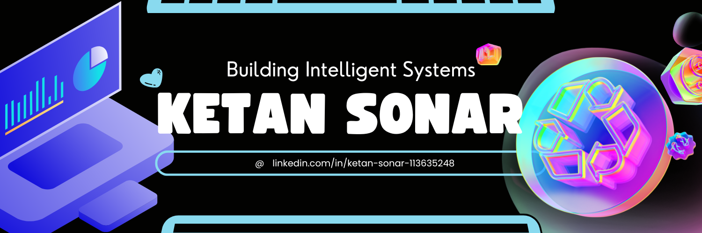
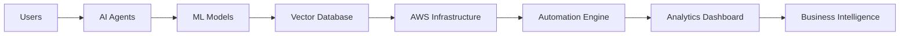

<div align="center">
  
</div>

<div align="center">


</div>

<br>

<div align="center">

<a href="https://www.linkedin.com/in/ketan-sonar-113635248">

</a>

<a href="https://github.com/littleDataChamp">

</a>


</div>

---

# ⚡ LIVE TERMINAL

<div align="center">


</div>

---

# ⚡ SYSTEM INITIALIZATION

```yaml
Name: Ketan Sonar
Role: AI Engineer + Cloud Architect
Location: Mumbai, India

Organization:
  - SONAR

Core Domains:
  - Artificial Intelligence
  - Machine Learning
  - AWS Cloud
  - Automation Systems
  - Agentic AI
  - Data Science
  - Edge AI

Current Focus:
  - DAKSH AI Ecosystem
  - KHODIX Marketplace
  - SONAR Automation Systems

Mission:
  - Building AI-Native Infrastructure
  - Engineering Autonomous Systems
  - Empowering Talent using AI
```

---

# 🧠 ABOUT ME

```python
class KetanSonar:

    def __init__(self):

        self.role = "AI Engineer"
        self.company = "SONAR"
        self.location = "Mumbai"

        self.specialization = [
            "Artificial Intelligence",
            "Cloud Infrastructure",
            "Automation Systems",
            "Data Science",
            "Machine Learning",
            "Agentic AI"
        ]

    def current_projects(self):

        return [
            "DAKSH → AI Job Recommendation System",
            "KHODIX → Heavy Machinery Marketplace",
            "SONAR → AI Automation Ecosystem"
        ]

    def philosophy(self):

        return "The future belongs to autonomous systems."
```

---

# 🚀 FEATURED PROJECTS

<div align="center">

| 🚀 PROJECT | ⚡ DESCRIPTION |
|---|---|
| 📡 **Sonar Mobility Grid** | Decentralized Edge AI communication system for real-time hazard detection |
| 🤖 **Gemini Telegram Bot** | Conversational AI assistant powered by Gemini API |
| 🧠 **DAKSH** | AI-powered local employment recommendation ecosystem |
| 🏗️ **KHODIX** | Heavy machinery digital marketplace infrastructure |
| 🏥 **Hospital Analysis Dashboard** | Healthcare analytics dashboard & visualization system |
| 💬 **SONAR Smart Loyalty System** | WhatsApp-driven AI loyalty automation platform |

</div>

---

# ⚙️ TECH STACK

<div align="center">


<br><br>


</div>

---

# 🌐 AI + CLOUD ECOSYSTEM



---

# 🤖 NEURAL NETWORK VISUALIZATION

```text
                ┌──────────────────────┐
                │     USER INPUT       │
                └──────────┬───────────┘
                           │
                  ┌────────▼────────┐
                  │   AI AGENTS     │
                  └────────┬────────┘
                           │
             ┌─────────────▼─────────────┐
             │   MACHINE LEARNING CORE   │
             └─────────────┬─────────────┘
                           │
                  ┌────────▼────────┐
                  │ AWS CLOUD LAYER │
                  └────────┬────────┘
                           │
               ┌───────────▼───────────┐
               │ AUTOMATION ECOSYSTEM  │
               └───────────────────────┘
```

---

📊 GITHUB ANALYTICS
# 
<div align="center">


</div>

</div>

---

# 🛰️ CONTRIBUTION GRAPH

<div align="center">


</div>

---

# 🐍 CONTRIBUTION SNAKE

<div align="center">


</div>

---

# ⚙️ SYSTEM METRICS

```yaml
AI_POWER:           ██████████████ 95%
AWS_ARCHITECTURE:   █████████████  90%
AUTOMATION:         ██████████████ 96%
DATA_SCIENCE:       ████████████   88%
INNOVATION:         ██████████████ 100%
```

---

# 🌌 CYBERPUNK NETWORK

```diff
+ NODE_01 :: SONAR CORE CONNECTED
+ NODE_02 :: AI SYSTEMS ONLINE
+ NODE_03 :: CLOUD INFRASTRUCTURE ACTIVE
+ NODE_04 :: MACHINE LEARNING DEPLOYED
+ NODE_05 :: AGENTIC AI RUNNING
+ NODE_06 :: FUTURE SYSTEMS INITIALIZED
```

---

# 🚀 DEPLOYMENT STATUS

```javascript
const KetanSonar = {

    role: "AI Engineer",
    company: "SONAR",

    currentlyBuilding: [
        "DAKSH",
        "KHODIX",
        "AI Automation Systems"
    ],

    technologies: [
        "Python",
        "AWS",
        "TensorFlow",
        "Docker",
        "React"
    ],

    status: "BUILDING THE FUTURE 🚀"
}
```

---

# 🛰️ ACTIVE AI PROTOCOL

```ini
[SONAR_AI_PROTOCOL]

STATUS=ONLINE
AI_MODE=ACTIVE
AWS_INFRA=CONNECTED
AUTOMATION=RUNNING
NEURAL_NETWORK=TRAINING
EDGE_AI=DEPLOYED
SECURITY=ENABLED

MISSION=ENGINEERING_THE_FUTURE
```

---

# 🔥 AI ENGINE CORE

<div align="center">


</div>

---

# 🌐 SYSTEM LOAD BALANCER

```yaml
CPU_USAGE:          ███████████░░ 82%
GPU_ACCELERATION:   █████████████ 94%
CLOUD_SCALING:      ████████████░ 89%
VECTOR_DB_STATUS:   █████████████ 97%
AI_AGENT_STATUS:    █████████████ 100%
```

---

# 🚨 SECURITY FIREWALL STATUS

```diff
+ FIREWALL :: ACTIVE
+ ENCRYPTION :: ENABLED
+ CLOUD SECURITY :: VERIFIED
+ AI ACCESS CONTROL :: ACTIVE
+ THREAT DETECTION :: MONITORING
```

---

# 🏗️ CURRENTLY ENGINEERING

<div align="center">

| SYSTEM | STATUS |
|---|---|
| 🧠 DAKSH AI Recommendation Engine | 🟢 ACTIVE |
| 🏗️ KHODIX Infrastructure | 🟡 IN DEVELOPMENT |
| ☁️ AWS Cloud Automation | 🟢 ACTIVE |
| 🤖 Agentic AI Ecosystem | 🟣 RESEARCH |
| 📡 Edge AI Communication | 🔵 PROTOTYPE |

</div>

---

# 🔥 SYSTEM PHILOSOPHY

```diff
+ Privacy-First AI
+ Autonomous Infrastructure
+ Decentralized Intelligence
+ AI Native Systems
+ Cloud-Scale Automation
+ Future-Ready Ecosystems
```

---

# 🌌 CONNECT WITH ME

<div align="center">

<a href="https://www.linkedin.com/in/ketan-sonar-113635248">

</a>

<a href="https://github.com/littleDataChamp">

</a>

<a href="mailto:yourmail@gmail.com">

</a>

</div>

---

<div align="center">


</div>
````
