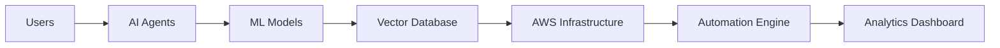

<div align="center">


#  Ketan Sonar

### ⚡ AI Engineer • Data Scientist • Cloud Architect • Founder of SONAR


<br>

<a href="https://www.linkedin.com/in/ketan-sonar-113635248">

</a>

<a href="https://github.com/littleDataChamp">

</a>


</div>

---

# ⚡ SYSTEM INITIALIZATION

```yaml
Name: Ketan Sonar
Role: AI Engineer + Data Scientist
Location: Mumbai, India

Organization:
  - SONAR

Domains:
  - Artificial Intelligence
  - Machine Learning
  - AWS Cloud
  - Data Science
  - Automation Systems
  - Agentic AI
  - Edge AI

Current Projects:
  - DAKSH
  - KHODIX
  - SONAR AI Ecosystem

Mission:
  - Build AI-native scalable systems
  - Empower local talent using AI
  - Engineer future-ready cloud infrastructure
```

---

# 🧠 ABOUT ME

```python
class KetanSonar:

    def __init__(self):

        self.role = "AI Engineer"
        self.company = "SONAR"
        self.location = "Mumbai"

        self.specialization = [
            "Artificial Intelligence",
            "AWS Infrastructure",
            "Automation Systems",
            "Data Science",
            "Recommendation Engines"
        ]

    def currently_building(self):

        return [
            "DAKSH → AI Job Recommendation System",
            "KHODIX → Heavy Machinery Marketplace",
            "SONAR → AI Automation Ecosystem"
        ]

    def philosophy(self):

        return "Autonomous AI systems will shape the future."
```

---

# 🚀 FEATURED PROJECTS

| 🚀 Project | ⚡ Description |
|---|---|
| 📡 **Sonar Mobility Grid** | Decentralized Edge AI communication system for real-time hazard detection |
| 🤖 **Gemini Telegram Bot** | Conversational AI bot powered by Gemini API |
| 🧠 **DAKSH** | AI-powered job recommendation ecosystem for local skilled workers |
| 🏗️ **KHODIX** | Digital marketplace for heavy machinery & construction industry |
| 🏥 **Hospital Analysis Dashboard** | Healthcare analytics dashboard for real-time visualization |
| 💬 **SONAR Smart Loyalty System** | WhatsApp-driven AI customer loyalty platform |

---

# ⚙️ TECH STACK

<div align="center">


</div>

---

# 🌐 AI + CLOUD ECOSYSTEM



---

# 📊 GITHUB ANALYTICS

<div align="center">


<br><br>


</div>

---

# 🛰️ CONTRIBUTION GRAPH

<div align="center">


</div>

---

# 🐍 CONTRIBUTION SNAKE

<div align="center">


</div>

---

# 🏗️ CURRENTLY ENGINEERING

| SYSTEM | STATUS |
|---|---|
| 🧠 DAKSH AI Recommendation Engine | 🟢 Active |
| 🏗️ KHODIX Infrastructure | 🟡 Planning |
| ☁️ AWS Cloud Automation | 🟢 Active |
| 🤖 Agentic AI Ecosystem | 🟢 Researching |
| 📡 Edge AI Communication | 🟣 Prototype |

---

# 🔥 SYSTEM PHILOSOPHY

```diff
+ Privacy-First AI
+ Autonomous Systems
+ Decentralized Intelligence
+ AI Native Infrastructure
+ Scalable Cloud Ecosystems
```

---

# 🌌 CONNECT WITH ME

<div align="center">

<a href="https://www.linkedin.com/in/ketan-sonar-113635248">

</a>

<a href="https://github.com/littleDataChamp">

</a>

<a href="mailto:yourmail@gmail.com">

</a>

</div>

---

<div align="center">


</div>
````
